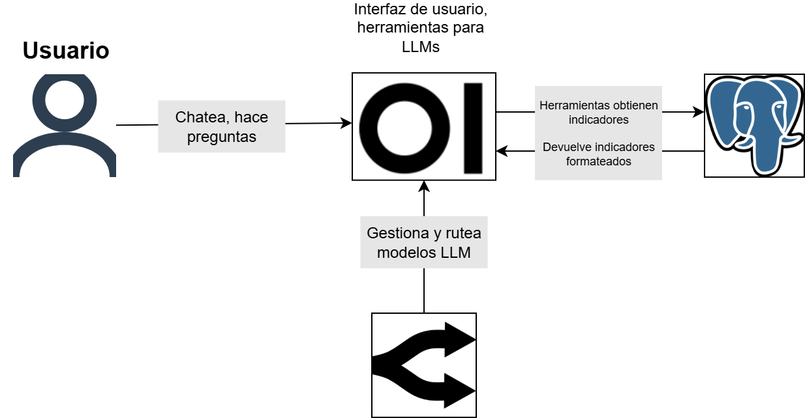
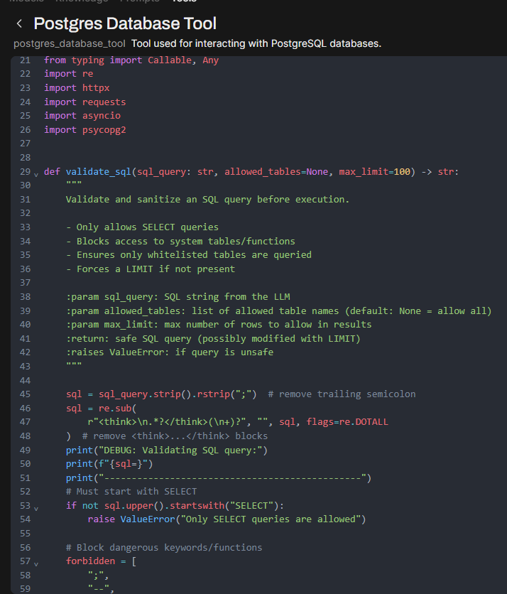
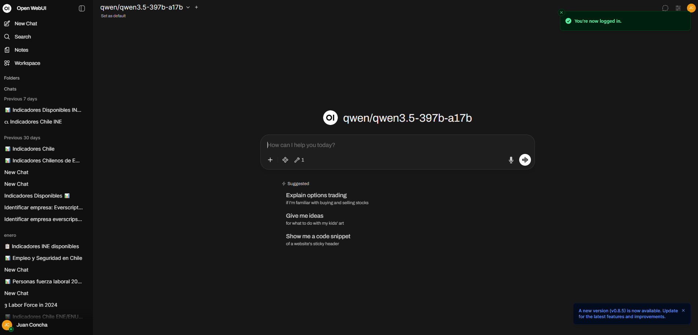
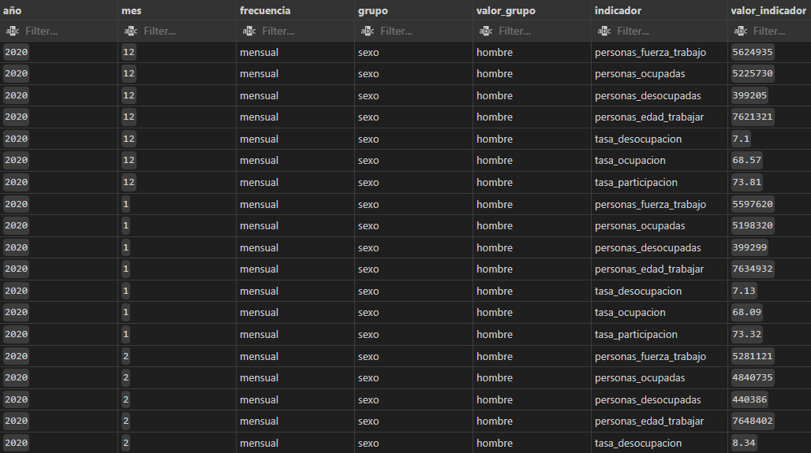
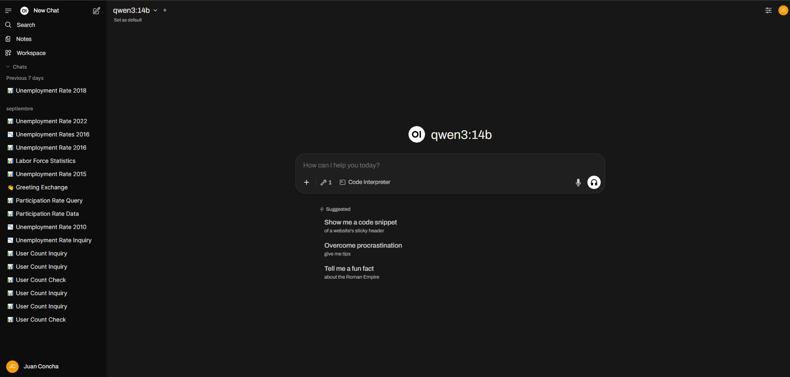
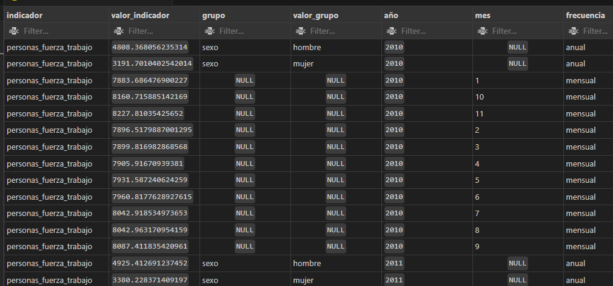

## { .portada  #portada}

  

  <h1> Chatbot factual</h1>
  
  <h2>Unidad de Gobierno de Datos</h2>
  
  
<strong>09 de enero 2026</strong>

## Contenidos 

- Motivación
- Arquitectura
- Cómo se ve
<!--   - Open-WebUI -->
<!--   - Ollama -->
<!--   - PostgreSQL -->
- Etapas del trabajo
- Indicadores disponibles

- Demostración en vivo
- Qué nos falta
<!-- - Próximos pasos -->

## Motivación { .larger-text }

::: incremental
- Sabemos que los chatbots basados en LLMs tienden a generar información inexacta o **"alucinar"**
- Para usuarios que buscan **estadísticas oficiales**, esto representa un riesgo significativo
- La **confiabilidad de los datos** es fundamental en nuestro contexto
:::

## Solución { .larger-text }

::: incremental
- Desarrollamos un chatbot que se conecta **directamente a datos oficiales**
- Se le "enseña" a no dar información que no conozca
- Esto garantizaría respuestas basadas en **información verificada y autorizada**
- Combina la **interacción natural** de un chatbot con la **precisión** de datos oficiales
- Utilizamos una estructura de datos que permite una **fácil expansión a más indicadores**.
:::

## Arquitectura

:::: {.columns}

::: {.column width="30%"}

Generamos tres componentes principales que interactúan entre sí:

- {height=80px .icon}  **Open-WebUI**: Interfaz de usuario para la interacción con el chatbot
- {height=80px .icon} **Openrouter**: Ruteador de LLMs a la mayoría de proveedores disponibles.
- {height=80px .icon} **PostgreSQL**: Base de datos para almacenamiento persistente
:::

::: {.column width="70%"}
{width=100% height=auto}
:::

::::

## Qué son las herramientas

:::: columns

::: {.column width="50%"}

::: fragment
Las herramientas son la pieza clave para que esta arquitectura funcione.
:::

::: fragment
No es más que código de Python que la LLM puede correr para obtener cierto resultado.
:::

::: incremental

::: fragment
El desafío consiste en que la LLM entienda **cuándo** y **cómo** correr este código y 
que el código mismo solo pueda correrse **de forma segura**. 
:::

  - El código y las prompt deben diseñarse cuidadosamente en torno a estos desafíos.
  - Queremos minimizar la responsabilidad de la LLM: mientras más podamos gestionar con
  código, menor chance de error.

:::

:::

:::  {.column width="50%}

{width=70%}
:::

::::

## Cómo se ve

## Etapas del trabajo

Para el desarrollo de este piloto hemos pasado por diversas etapas.

::: fragment

**Fase I: estudio y desarrollo prototipo inicial**

  - Estudio de tecnologías disponibles
  - Desarrollo inicial con infraestructura INE
  - Planificación de estructura de datos para consumo de LLM
  - Recolección de indicadores iniciales (ENE)
  - Pruebas de funcionalidad

:::

::: fragment
**Fase II: refinamiento prototipo**

  - Primera expansión de indicadores (ENUSC)
  - Implementación estructura de datos actual.
  - Pruebas internas de funcionalidad y recolección de feedback del equipo de Ciencia de Datos
  - Pruebas internas de funcionalidad y recolección de feedback del equipo de ENUSC
  - Incorporación de comentarios y otras mejoras a la aplicación.
  - Adaptación de la aplicación para conexión a proveedores externos.

:::

## Indicadores disponibles 

Tenemos 11 indicadores de disponibles:

**ENUSC:**

| Indicador  | Período | Agrupaciones |
|-----------|-------------|---------|--------------|
| Percepción de aumento de la delincuencia | 2018-2024 | Nacional, región, sexo |
| Victimización hogares por delitos mayor connotación | 2018-2022 | Nacional, región |
| Victimización hogares por delitos violentos | 2023-2024 | Nacional, región |
| Victimización personas por delitos violentos | 2023-2024 | Nacional, región, sexo |

## Indicadores disponibles

Tenemos 11 indicadores de disponibles:

**ENE:**

- Período: 2010 - 2025
- Agrupaciones: nacional y sexo
- Indicadores:
  - Población desocupada
  - Población en edad de trabajar
  - Personas en la fuerza de trabajo
  - Población ocupada
  - Tasa de desocupación
  - Tasa de ocupación
  - Tasa de participación laboral
  
## Indicadores disponibles

Un vistazo a los datos

{.r-stretch .narrow}

<!-- ## Open-WebUI -->

<!-- :::: columns -->

<!-- ::: {.column width="55%} -->
<!-- **¿Qué es Open-WebUI?** -->

<!-- ::: incremental -->
<!-- - Interfaz web de código abierto diseñada para interactuar con modelos de lenguaje -->
<!-- - Experiencia similar a ChatGPT pero auto-hospedada (_self-hosted_) -->
<!-- - Al ser open source, es altamente personalizable y extensible -->
<!-- ::: -->

<!-- **Características principales** -->

<!-- ::: incremental -->
<!-- - Interfaz de chat intuitiva y moderna -->
<!-- - Soporte para múltiples modelos simultáneos -->
<!-- - Sistema de **herramientas (tools)** personalizables basadas en Python  para extender funcionalidades -->
<!-- - Gestión de usuarios y permisos -->
<!-- - Historial de conversaciones persistente -->
<!-- ::: -->

<!-- ::: -->

<!-- ::: {.column  width="45%"} -->

<!-- ::: incremental -->
<!-- **En el proyecto** -->

<!-- - Actúa como la capa de presentación del chatbot -->
<!-- - Permite a los usuarios hacer consultas en lenguaje natural -->
<!-- - Integra herramientas personalizadas para acceder a datos oficiales -->
<!-- - Facilita la autenticación y gestión de sesiones -->
<!-- ::: -->

<!-- **Ventajas** -->

<!-- ::: incremental -->
<!-- - No depende de servicios externos -->
<!-- - Control total sobre datos y privacidad -->
<!-- - Muchísimo más sencillo que desarrollar nuestro propio software de chat. -->
<!-- ::: -->

<!-- ::: {.align-right} -->
<!-- {height=400px} -->
<!-- ::: -->

<!-- ::: -->

<!-- :::: -->

<!-- ## Open-WebUI -->

<!-- ::: align-center -->
<!-- {height=1000px } -->
<!-- ::: -->

<!-- ## Ollama -->

<!-- :::: columns -->

<!-- ::: {.column width="55%"} -->
<!-- **¿Qué es?** -->

<!-- ::: incremental -->
<!-- - Plataforma de código abierto para ejecutar LLMs localmente -->
<!-- - Simplifica su descarga, gestión y ejecución -->
<!-- ::: -->

<!-- **Características clave** -->

<!-- ::: incremental -->
<!-- - Soporte para múltiples modelos (Qwen, Llama, Gemma, etc.) -->
<!-- - Gestión automática de memoria y recursos -->
<!-- - Optimizaciones de rendimiento para CPUs y GPUs -->
<!-- - API compatible con OpenAI haciendo fácil su integración -->
<!-- ::: -->

<!-- ::: -->

<!-- ::: {.column width="45%"} -->

<!-- **En nuestro proyecto** -->

<!-- ::: incremental -->
<!-- - Motor de inferencia que procesa las consultas del usuario -->
<!-- - Ejecuta el modelo de lenguaje que interpreta preguntas -->
<!-- - Genera respuestas contextuales basadas en la información disponible -->
<!-- - Se comunica con Open-WebUI a través de su API -->
<!-- ::: -->

<!-- **Ventajas** -->

<!-- ::: incremental -->
<!-- - Ejecución local sin dependencia de APIs externas  -->
<!-- - Control sobre versiones de modelos -->
<!-- - Latencia reducida al eliminar llamadas a servicios remotos -->
<!-- - Sin límites de uso o costos por token -->
<!-- ::: -->

<!-- ::: {.align-right} -->
<!-- {height=200px} -->
<!-- ::: -->

<!-- ::: -->

<!-- :::: -->

<!-- ## PostgreSQL -->

<!-- - Esta es la estructura de las bases de datos. -->

<!-- {height=750px} -->

<!-- - Busca un sistema estándar que permita desagregar datos y contener datos nacionales -->
<!-- dentro de la misma. -->

<!-- ## Desafíos -->

<!-- **Escalabilidad** -->

<!-- - Cargar un LLM es computacionalmente intensivo -->
<!-- - Dificultad para servir a múltiples usuarios simultáneos -->
<!-- - Requiere planificación cuidadosa de recursos -->

## Demostración en vivo

Y ahora veremos [cómo funciona en la práctica](http://10.0.40.11:3031/)

## Qué nos falta { .larger-text }

- Presupuesto para poder servir múltiples usuarios

- **Expandir indicadores disponibles.**

- **Implementación de feedback faltantes.**

- Mejoras internas para mayor robustez en las respuestas

- Implementación de medidas de seguridad de cara a la producción.

<!-- ## Próximos pasos -->

<!-- **Expansión y mejoras** -->

<!-- ::: {.incremental} -->
<!-- - **Ampliar cobertura**: Expandir el número de indicadores disponibles -->
<!-- - **Desarrollo de API**: Estudiar la posibilidad de desarrollar una API dedicada para la conexión de herramientas -->
<!-- - **Más pruebas de seguridad**: Tenemos que asegurarnos que en una gran mayoría de casos -->
<!--   el chatbot no entregue información inventada. -->
<!-- ::: -->

<!-- ## Discusión -->

## { .portada #cierre}

  

  <h1>Presentaciones internas: Chatbot factual</h1>
  
  <h2>Unidad de Gobierno de Datos</h2>
  
  
<strong>30 de octubre 2025</strong>

